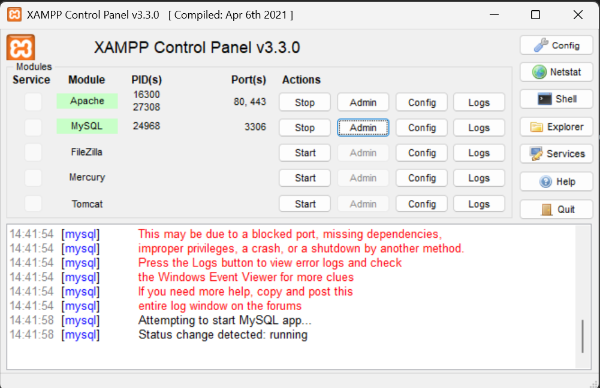
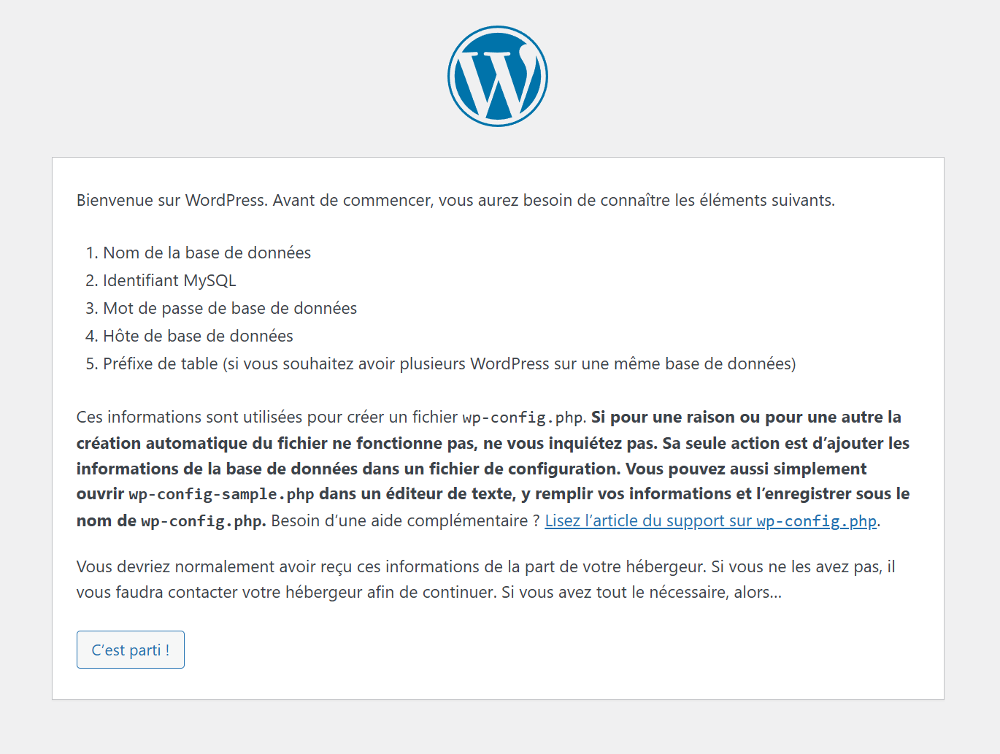
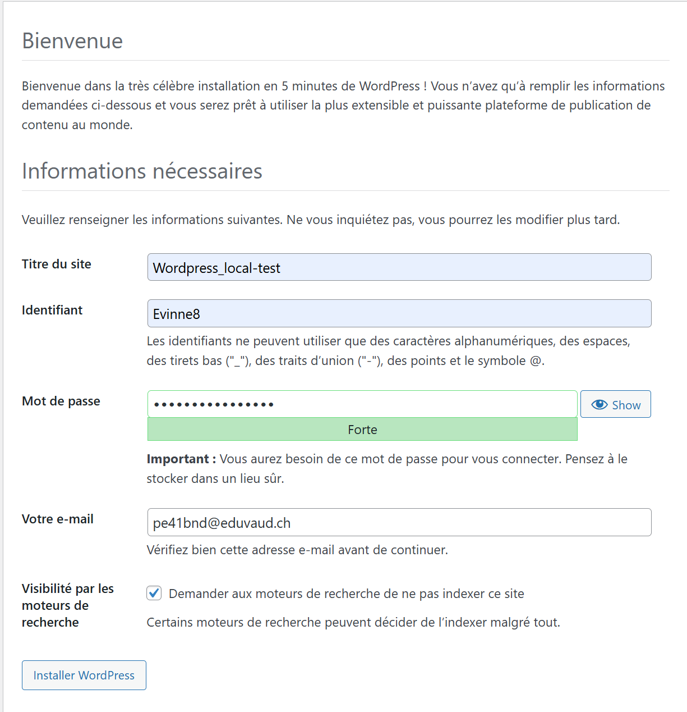
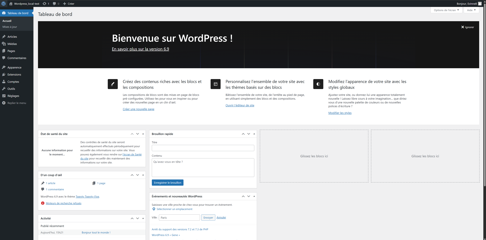

# fiche-de-stage-WordPress
## Qu'est-ce que WordPress ?
WordPress est un CMS (Content Management System) open source, qui permet de créer des sites web et des blogs. Il est basé sur PHP et utilise une base de données MySQL pour stocker les données. Wordpress a été créé en 2003 par Matt Mullenweg et Mike Little. Il a été initialement conçu pour être utilisé par des blogs, mais aujourd'hui, il est utilisé pour créer des sites web de toutes sortes.

### Wordpress est-il beaucoup utilisé ?
Oui, Wordpress est le CMS le plus utilisé au monde. En 2025, WordPress propulse environ 43,2% à 43,5% de tous les sites web dans le monde, ce qui représente environ 478 millions de sites actifs.

### Combien coûte WordPress ? 
Le logiciel WordPress en lui-même est 100% gratuit et open source, mais il existe des options de licences payantes pour obtenir des fonctionnalités supplémentaires, comme des plugins et des thèmes premium. Il faut généralement payer un hébergement web et un nom de domaine pour mettre un site en ligne.

###  Quelle est la différence entre wordpress.com et wordpress.org ?
- WordPress.org est la version "logiciel libre". C'est celle que l'on télécharge pour l'installer sur son propre hébergement web. C'est la solution privilégiée par les professionnels car elle permet d'avoir le contrôle total du site (code, thèmes, extensions).
- WordPress.com est une plateforme commerciale d'hébergement (comme un service clé en main). C'est plus simple donc c'est mieux pour les débutants, mais la version gratuite impose des publicités et limite grandement les possibilités de personnalisation (thèmes/plugins).

### Qu'est-ce qu'un CMS ?
Un CMS (Content Management System) est un logiciel qui permet de gérer le contenu d'un site web. Il permet de créer, modifier et publier du contenu à l'aide d'une interface graphique sans avoir besoin de savoir comment coder.

## installation locale
### Prérequis technologiques
Pour fonctionner, WordPress ne peut pas être lancé comme un simple logiciel de traitement de texte. Il a besoin d'un environnement serveur spécifique souvent résumé par l'acronyme AMP (Apache, MySQL, PHP). Plus précisément, voici les éléments indispensables :

- Un serveur Web : Généralement Apache ou Nginx, pour traiter les requêtes HTTP.
- Un interpréteur PHP : WordPress est codé en PHP, il a donc besoin que le serveur puisse lire ce langage.
- Un serveur de base de données : MariaDB ou MySQL, pour stocker les articles, les réglages et les utilisateurs.

#### QU'est ce que `LAMP`, `MAMP`, `WAMP` et `XAMP`
Je vous ai déjà parlé de l'acronyme AMP. La lettre d'avant spécifie simplement l'OS pour lequelle le programme est optimisé :
- `L` : Linux
- `M` : Macos
- `W` : Windows
- `X` : Multi-plateform (Linux, Windows, MacOS).

### Procédure d'installation sur Windows 11
Pour cette installation, je me suis basé sur le guide : [Installer WordPress sur Windows 11 (5 méthodes simples)](https://seahawkmedia.com/fr/wordpress/install-wordpress-windows/#Why_Do_You_Need_to_Install_WordPress_Locally).

J'ai choisi d'utiliser XAMPP. Ayant déjà eu une petite expérience avec cet outil sur un projet précédent, il me permet de simuler un environnement serveur complet sur ma machine locale.

> Vu que je travaille sur Windows, j'aurais également pu utiliser WAMP. La différence principale réside dans le fait que WAMP est optimisé spécifiquement pour l'OS Windows, tandis que XAMPP est multiplateforme, ce qui le rend plus polyvalent si je devais changer d'OS. De plus, j'ai déjà XAMPP d'installer sur mon ordinateur.

#### Étapes suivies :
Téléchargement et installation de XAMPP :
- Installez les modules Apache et MySQL.
- Lancez "XAMPP Control Panel" et démarrez ces deux services.

Préparation de la base de données :
- Accèdez à http://localhost/phpmyadmin/.
- Créez une nouvelle base de données nommée wordpress_db.

Mise en place des fichiers :
- Téléchargez du fichier .zip sur [wordpress.org](https://fr.wordpress.org/download/).
- Extraction du contenu dans le dossier C:\xampp\htdocs\my_wordpress.

Configuration et installation via le navigateur :

- Accèdez à http://localhost/my_wordpress :

- Saisissez des informations de connexion à la base de données (User: root, Password: (vide)).
- Définissez les identifiants administrateur du site :

Après avoir cliquer sur "Installer Wordpress", cliquer sur "se connecter" et entrer les identifiants mis précédemment pour arriver sur cette page d'admin :

<strong style="font-size: 40px">Voila wordpress est installé en local !!!<strong>