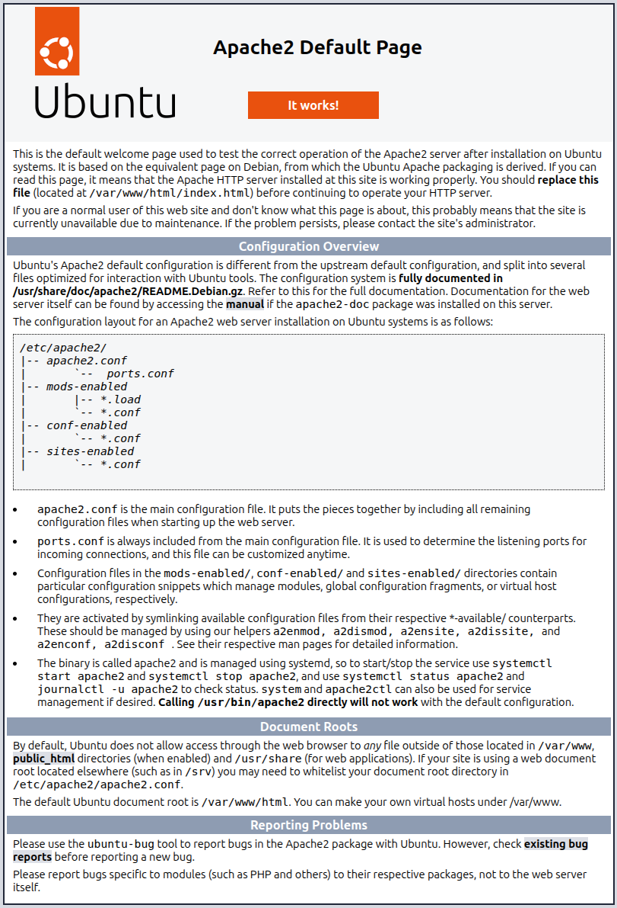
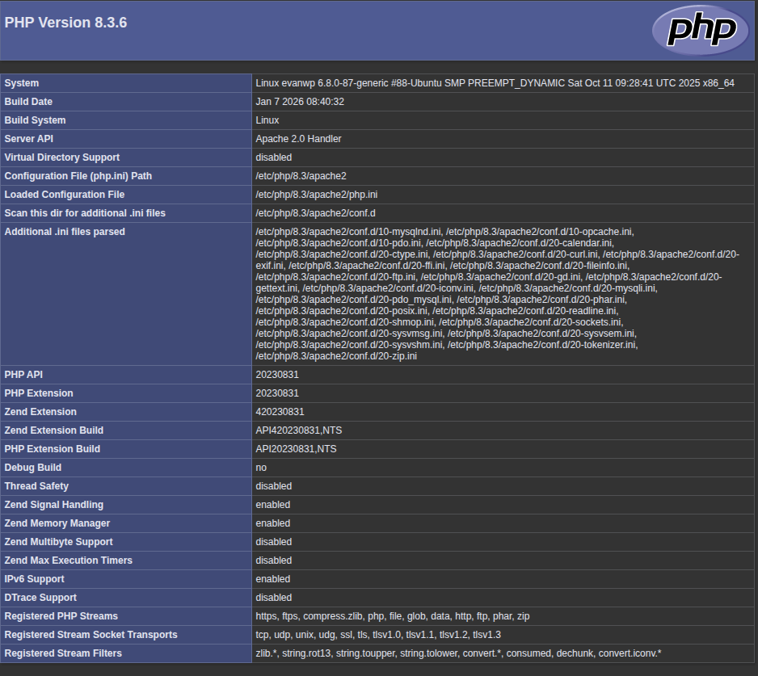
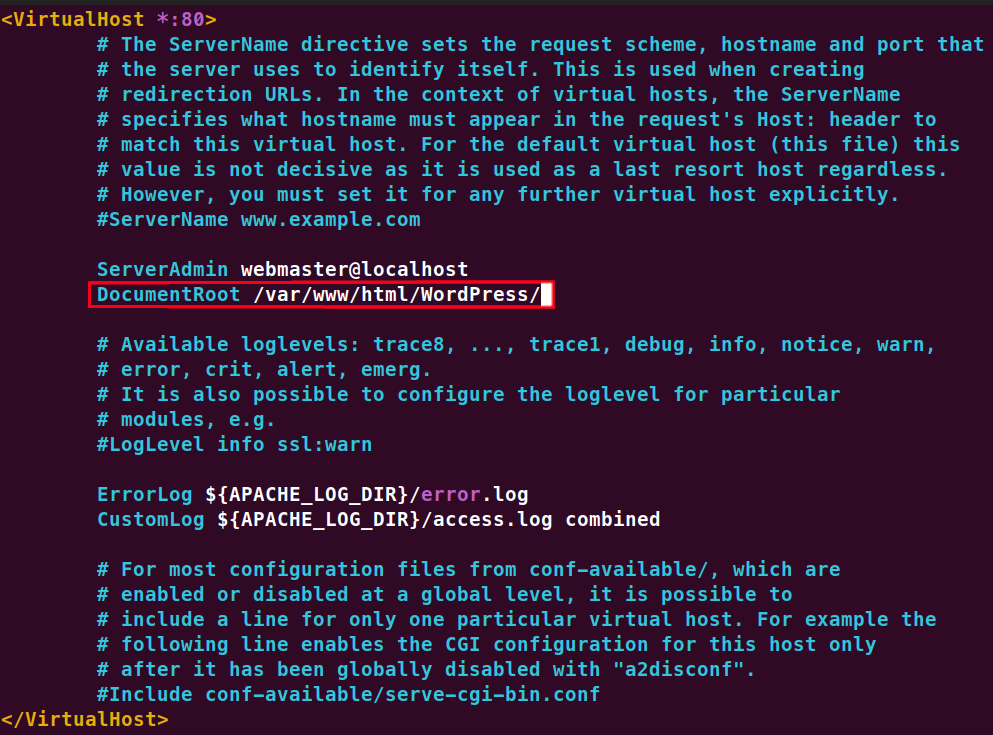
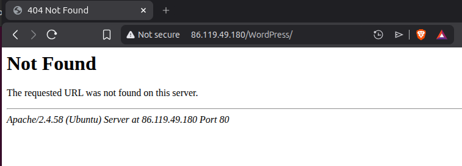
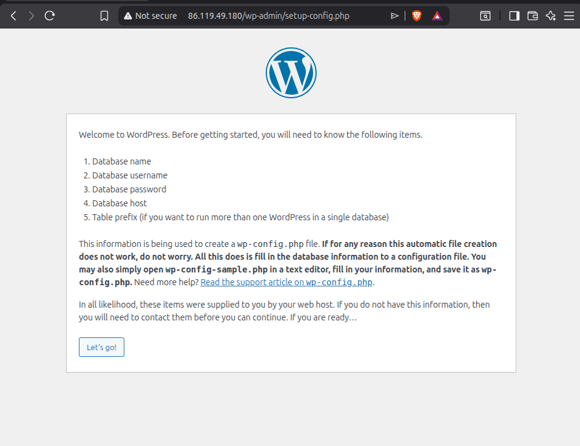
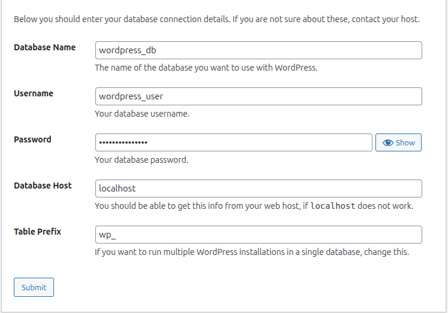
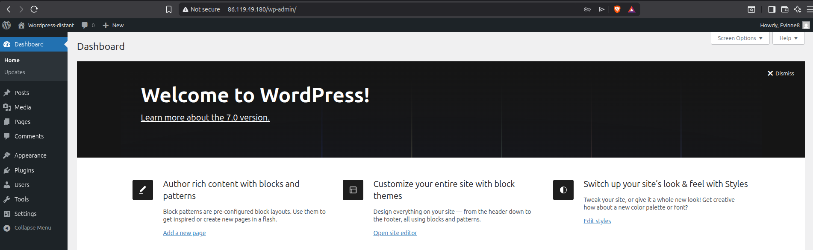

# fiche-de-stage-WordPress
## Qu'est-ce que WordPress ?
WordPress est un CMS (Content Management System) open source, qui permet de créer des sites web et des blogs. Il est basé sur PHP et utilise une base de données MySQL pour stocker les données. Wordpress a été créé en 2003 par Matt Mullenweg et Mike Little. Il a été initialement conçu pour être utilisé par des blogs, mais aujourd'hui, il est utilisé pour créer des sites web de toutes sortes.

### Wordpress est-il beaucoup utilisé ?
Oui, Wordpress est le CMS le plus utilisé au monde. En 2025, WordPress propulse environ 43,2% à 43,5% de tous les sites web dans le monde, ce qui représente environ 478 millions de sites actifs.

### Combien coûte WordPress ? 
Le logiciel WordPress en lui-même est 100% gratuit et open source, mais il existe des options de licences payantes pour obtenir des fonctionnalités supplémentaires, comme des plugins et des thèmes premium. Il faut généralement payer un hébergement web et un nom de domaine pour mettre un site en ligne.

###  Quelle est la différence entre wordpress.com et wordpress.org ?
- WordPress.org est la version "logiciel libre". C'est celle que l'on télécharge pour l'installer sur son propre hébergement web. C'est la solution privilégiée par les professionnels car elle permet d'avoir le contrôle total du site (code, thèmes, extensions).
- WordPress.com est une plateforme commerciale d'hébergement (comme un service clé en main). C'est plus simple donc c'est mieux pour les débutants, mais la version gratuite impose des publicités et limite grandement les possibilités de personnalisation (thèmes/plugins).

### Qu'est-ce qu'un CMS ?
Un CMS (Content Management System) est un logiciel qui permet de gérer le contenu d'un site web. Il permet de créer, modifier et publier du contenu à l'aide d'une interface graphique sans avoir besoin de savoir comment coder.

## installation locale
### Prérequis technologiques
Pour fonctionner, WordPress ne peut pas être lancé comme un simple logiciel de traitement de texte. Il a besoin d'un environnement serveur spécifique souvent résumé par l'acronyme AMP (Apache, MySQL, PHP). Plus précisément, voici les éléments indispensables :

- Un serveur Web : Généralement Apache ou Nginx, pour traiter les requêtes HTTP.
- Un interpréteur PHP : WordPress est codé en PHP, il a donc besoin que le serveur puisse lire ce langage.
- Un serveur de base de données : MariaDB ou MySQL, pour stocker les articles, les réglages et les utilisateurs.

#### QU'est ce que `LAMP`, `MAMP`, `WAMP` et `XAMP`
Je vous ai déjà parlé de l'acronyme AMP. La lettre d'avant spécifie simplement l'OS pour lequelle le programme est optimisé :
- `L` : Linux
- `M` : Macos
- `W` : Windows
- `X` : Multi-plateform (Linux, Windows, MacOS).

### Procédure d'installation sur Windows 11
Pour cette installation, je me suis basé sur le guide : [Installer WordPress sur Windows 11 (5 méthodes simples)](https://seahawkmedia.com/fr/wordpress/install-wordpress-windows/#Why_Do_You_Need_to_Install_WordPress_Locally).

J'ai choisi d'utiliser XAMPP. Ayant déjà eu une petite expérience avec cet outil sur un projet précédent, il me permet de simuler un environnement serveur complet sur ma machine locale.

> Vu que je travaille sur Windows, j'aurais également pu utiliser WAMP. La différence principale réside dans le fait que WAMP est optimisé spécifiquement pour l'OS Windows, tandis que XAMPP est multiplateforme, ce qui le rend plus polyvalent si je devais changer d'OS. De plus, j'ai déjà XAMPP d'installer sur mon ordinateur.

#### Étapes suivies :
Téléchargement et installation de XAMPP :
- Installez les modules Apache et MySQL.
- Lancez "XAMPP Control Panel" et démarrez ces deux services.


Préparation de la base de données :
- Accèdez à http://localhost/phpmyadmin/.
- Créez une nouvelle base de données nommée wordpress_db.

Mise en place des fichiers :
- Téléchargez du fichier .zip sur [wordpress.org](https://fr.wordpress.org/download/).
- Extraction du contenu dans le dossier C:\xampp\htdocs\my_wordpress.

Configuration et installation via le navigateur :

- Accèdez à http://localhost/my_wordpress :


- Saisissez des informations de connexion à la base de données (User: root, Password: (vide)).
- Définissez les identifiants administrateur du site :


Après avoir cliquer sur "Installer Wordpress", cliquer sur "se connecter" et entrer les identifiants mis précédemment pour arriver sur cette page d'admin :


<strong style="font-size: 40px">Voila wordpress est installé en local !!!</strong>


## Procédure d’installation de WordPress sur une VM distante

Pour m'aider à la réalisation de cette tâche, j'ai suivis les étapes de ces deux sites :
- [Install WordPress on an Ubuntu Instance](https://docs.oracle.com/en-us/iaas/Content/developer/wp-on-ubuntu/01-summary.htm)
- [Installation d’Apache + MySql/MariaDB + PHP + WordPress](https://les-enovateurs.com/debian-vps-apache-mysql-php-wordpress)

### Se rendre sur la VM :
```bash
ssh ubuntu@86.119.49.180
```

Mise à jour des paquets :
```bash
sudo apt update && sudo apt upgrade -y
```

### Installation d'apache2 :
```bash
sudo apt -y install apache2
```

Puis, lancer apache2 :
```bash
sudo systemctl start apache2
```

Vérifier que apache2 est bien lancé :
```bash
sudo systemctl status apache2
```
ou
```bash
curl localhost | grep -i apache
```
ou alors : Accéder à http://86.119.49.180 depuis votre machine physique.

Voila ce qui doit s'afficher :



### Installation de PHP :
```bash
sudo apt -y install php
sudo apt -y install php-mysql php-curl php-gd php-zip
```
Vérification de l'installation de PHP :
```bash
php -v
sudo systemctl restart apache2
```
Ajouter un fichier php de test :
```bash
sudo vim /var/www/html/info.php
```
Ajoutez-y le contenu suivant :
```php
<?php
phpinfo();
?>
```
Se connecter à 'http://86.119.49.180/info.php' depuis votre machine physique.
La page suivante doit s'afficher :



### Configurer le dossier html d'apache2
Configurez le serveur Apache pour lire et écrire dans le répertoire `/var/www/html`.

1. Ajoutez votre utilisateur au groupe `www-data` pour pouvoir modifier le répertoire `/var/www/html` :
    ```bash
    sudo adduser $user www-data
    ```

2. Changez le propriétaire du répertoire :
    ```bash
    sudo chown -R www-data:www-data /var/www/html
    ```

3. Modifiez les permissions sur les fichiers et le répertoire :
    ```bash
    sudo chmod -R g+rw /var/www/html
    ```

4. Redémarrez votre machine pour que les changements prennent effet.

### Installation de MariaDB
Maintenant, installer et configurer le serveur et le client MariaDB pour qu'il puisse être utilisé avec WordPress.

1. Installez le paquet du serveur MariaDB :
    ```bash
    sudo apt -y install mariadb-server mariadb-client
    ```

2. Lancez le script d'installation sécurisé :

    Sécuriser le serveur en créant un mot de passe pour l’accès administrateur, puis créer un autre utilisateur. Pour cela tapez la commande suivante :

    ```bash
     sudo mariadb-secure-installation
    ```

    [Lien vers le script de sécurisation](https://mariadb.com/docs/server/clients-and-utilities/deployment-tools/mariadb-secure-installation/)

3. Créer une base de données et un utilisateur pour WordPress :
    Entrez le mot de passe root de MariaDB et vérifier que vous êtes bien connecté à MariaDB :
    ```bash
    sudo mariadb -u root -p
    ```
    ```sql
    SHOW DATABASES;
    ```
    Puis, créez une base de données et un utilisateur pour WordPress :
    ```sql
    CREATE DATABASE wordpress_db;
    CREATE USER 'wordpress_user'@'localhost' IDENTIFIED BY 'votre_mot_de_passe';
    GRANT ALL PRIVILEGES ON wordpress_db.* TO 'wordpress_user'@'localhost';
    FLUSH PRIVILEGES;
    EXIT;
    ```

### Installation de WordPress

1. Se rendre sur le dossier qu’a créé Apache2 pour recevoir les pages PHP :
    ```bash
    cd /var/www/html
    ```

2. Pour récupérer le code de wordpress, on a besoin de git. 
    ```bash
    sudo apt-get install git
    ```

3. Récupérer le code de wordpress :
    ```bash
    git clone https://github.com/WordPress/WordPress.git
    ```
    Vérifier que le dossier a été créé :
    ```bash
    ls
    ```
    Vous devriez voir un dossier nommé `WordPress`.

4. Accéder à WordPress :
    ```
    http://86.119.49.180/WordPress
    ```

    


Mais on a pas encore de nom de domaine, il faut donc configurer un nom de domaine pour notre site.

Pour cela, il faut configurer un fichier .conf dans le dossier /etc/apache2/sites-available/ et l'activer avec un lien symbolique dans /etc/apache2/sites-enabled/.

1. Copier le fichier de configuration de base proposé par Apache grâce à cette commande :
    ```bash
    cp /etc/apache2/sites-available/000-default.conf /etc/apache2/sites-available/wordpress.conf
    ```

2. Modifier le fichier de configuration :
    ```bash
    sudo vim /etc/apache2/sites-available/wordpress.conf
    ```
    Changer juste la ligne `DocumentRoot` pour qu'elle pointe vers le dossier WordPress :
    


3. Désactiver la configuration par défaut d'apache2 :
    ```bash
    sudo a2dissite 000-default.conf
    ```

4. Activer la configuration du site wordpress.conf :
    ```bash
    sudo a2ensite wordpress.conf
    ```


5. Recharger Apache :
    ```bash
    sudo systemctl reload apache2
    ```

6. Vérifier que la configuration est bien prise en compte :

    Ancienne url : http://86.119.49.180/WordPress :

    
    
    Nouvelle url : http://86.119.49.180/

    

### Configuration de wordpress

Compléter les informations de configuration de wordpress avec les informations de la base de données MariaDB :



Dans l'étape 2, il vous demande de copier le fichier wp-config.php manuellement :
```bash
cp /var/www/html/WordPress/wp-config-sample.php /var/www/html/WordPress/wp-config.php
vim /var/www/html/WordPress/wp-config.php
```

et coller-y le contenu.

Ensuite entrer le titre du site, l'utilisateur, le mot de passe et l'email. Puis cliquer sur `Install WordPress`. Connecter vous à votre site avec l'utilisateur et le mot de passe que vous venez de créer.



<strong style="font-size: 40px">Voila, wordpress est installé sur la VM distante et est accessible depuis votre machine physique.</strong>